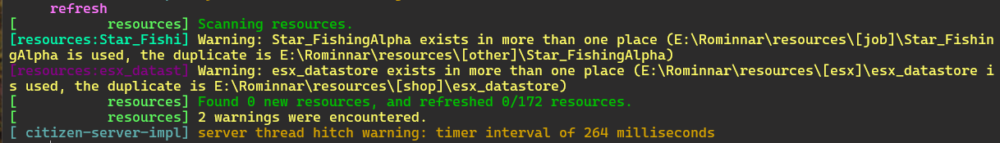
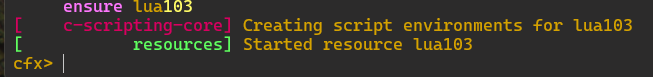
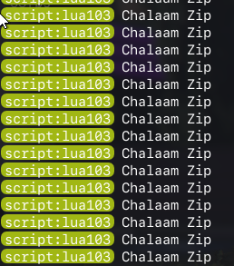

# Lua 103 While Loop

```
This Lua programing project create for my portfolio
```

### Client file in client folder

file `client.lua`

```lua
Citizen.CreateThread(function()
    local Chalaam = "Chalaam Zip"
    while true do -- Infinity Loop
        Citizen.Wait(0)
        print(Chalaam)
    end
end)
```

#### Run file `server.bat`
#### เข้าสู่เกมส์

ดำเนินใช้คำสั่ง `refresh`


ดำเนินการใช้คำสั่ง  `ensure nameFile(ชื่อไฟล์)`


กด `f8` เพื่อตรวจสอบผลลัพธ์
